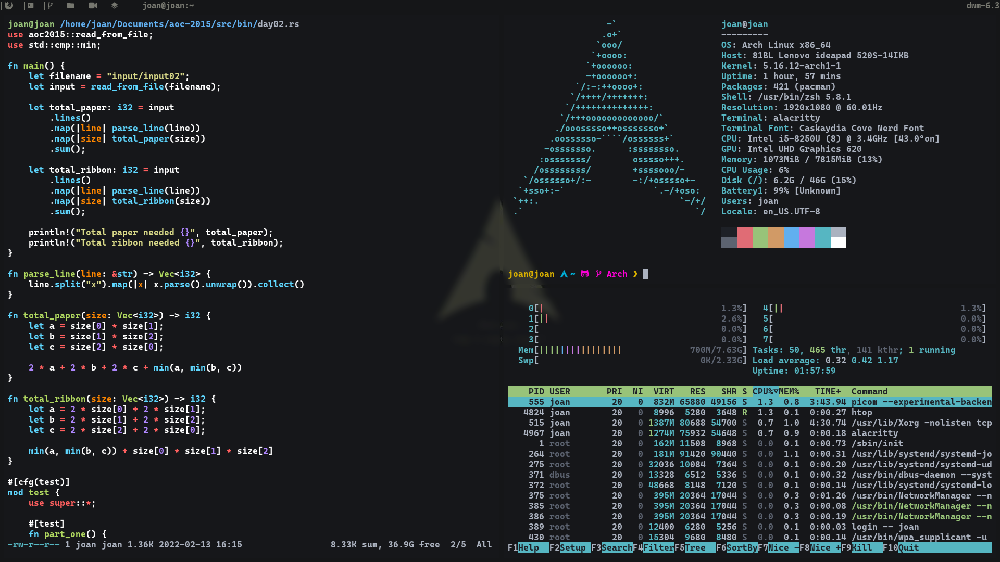

# Archlinux installation and configuration guide



- [Installation](#installation)
- [Configuration](#configuration)

## Installation

1- Select the keyboard layout:

```bash
loadkyes es
```

2- Connect to a network:

```bash
iwctl
[iwd] device list
[iwd] station device get-networks
[iwd] station device connect SSID
```

3- Verify internet connection:

```bash
ping archlinux.org
```

4- Update the system clock:

```bash
timedatectl set-ntp true
```

5- Partition the disk:

You have to create a Linux root (x86-64) partition and a Linux swap partition. If you want, you can also create a home partition.
In this case we are installing Archlinux alongside Windows, so we don't need to create a EFI or boot partition because we'll be using
windos EFI partition. You can use `cfdisk`, `fdisk`, `gdisk` or any tool you are familiar with to create the partitions.

6- Format the partitions:

Once you have created the partitions, you need to format them. Remember to check the created partitions with `lsblk`.

- Format the root partition ( / ):

```bash
mkfs.ext4 /dev/sdax
```

- Format the swap partition:

```bash
mkswap /dev/sdax
```

- Initialize swap partition:

```bash
swapon /dev/sdax
```

7- Mount the partitions:

Now mount the partitions that you just created and formatted.

- Mount root partition ( / ) in /mnt:

```bash
mount /dev/sdax /mnt
```
- Create /boot directory for boot partition:

```bash
mkdir -p /mnt/boot
```

- Mount Windows EFI system partition in /boot:

```bash
mount /dev/sdax /mnt/boot
```

8- Install essential packages:

```bash
pacstrap /mnt base linux linux-firmware
```

9- Generate the FSTAB:

```bash
genfstab -U /mnt >> /mnt/etc/fstab

```

10- Change root into the new system:

```bash
arch-chroot /mnt
```

11- Set the time zone:

```bash
ln -sf /usr/share/zoneinfo/Region/City /etc/localtime
```

12- Run `hwclock` to generate /etc/adjtime:

```bash
hwclock --systohc
```

13- Install `neovim` or any text editor:

```bash
pacman -S neovim
```

14- Edit `/etc/locale.gen` and uncomment `en_US.UTF-8 UTF-8` and other needed locales. Then generate the locales:

```bash
locale-gen
```

15- Create the `locale.conf` file, and set the `LANG` variable:

```bash
/etc/locale.conf |
-----------------

LANG=en_US.UTF-8
```

16- Set the keyboard layout in `vconsole.conf`:

```bash
/etc/vconsole.conf |
-------------------

KEYMAP=es
```

17- Create the hostname file:

```bash
/etc/hostname |
--------------

myhostname
```

18- Add matching entries to `hosts`:

```bash
/etc/hosts |
-----------

127.0.0.1	localhost
::1		localhost
127.0.1.1	myhostname.localdomain	myhostname
```

19- Set the root password:

```bash
passwd
```

20- To be sure that you have internet connection after reboot the system install and enable the `NetworkManager`:

```bash
pacman -S networkmanager
systemctl enable NetworkManager
```

21- Install the bootloader:

```bash
pacman -S grub efibootmgr os-prober
grub-install --target=x86_64-efi --efi-directory=/boot
os-prober
```

22- To detect other OS in your machine you have to edit the grub configuration file at `/etc/default/grub` and add `GRUB_DISABLE_OS_PROBER=false`:

```bash
/etc/default/grub |
------------------

GRUB_DISABLE_OS_PROBER=false
```

23- Create the grub configuration file:

```bash
grub-mkconfig -o /boot/grub/grub.cfg
```

24- Create your user:

```bash
useradd -m username
passwd username
usermod -aG wheel,video,audio,storage username
```

25- In order to have root privileges install `sudo`:

```bash
pacman -S sudo
```

26- Edit `/etc/sudoers` and uncomment this line to give your user root privileges:

```bash
## Uncomment to allow members of group wheel to execute any command
# %wheel ALL=(ALL) ALL
```

27- Unmount `/mnt` and reboot the system:

```bash
exit
umount -R /mnt
reboot
```

28- Once you reboot the system you won't have internet connection. To connect again to the network you can use
any tool such us `nmtui` or `nmcli`.

## Configuration

To config the system just clone this repository and run the `install.sh` script :

```bash
sudo pacman -S git
git clone https://github.com/joanjajas/dotfiles
sh ~/dotfiles/scripts/install.sh
```

If something goes wrong while runing the script, just rerun it, but everything should just work fine the first time 
you run the script.
